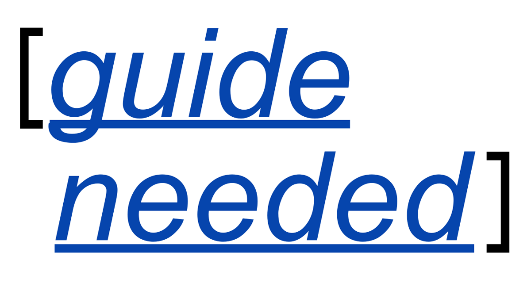

# GenR Guide Sprint Method

## Context: About GenR ‘Guides Needed’ programme

>   The GenR open science community platform has spent over three years
>   supporting and blogging about open science communities. From this experience
>   the decision was made to focus on **guides as being the best instrument for
>   condensing tacit knowledge and scaling open science values**. *Dec ‘21*

The Guides Needed programme is to support open science communities with
**‘editorial and publishing know-how’** to produce their own, volunteer run,
guides for good open science practice. The programme is closely aligned with the
Open Science Lab’s (TIB) NextGen Book service — which is sharing its know-how
and technology with the GenR community.

Blogpost: <https://genr.eu/wp/guide-needed/>

Discussion: <https://github.com/Gen-R/guide-needed/discussions>

## Method objectives

The method is designed to help speedily produce different types of guides:
step-by-step guides, cheat sheets, comprehensive guide books, reformat and
improve existing guides, remix guides, to software manuals.

The method is designed support researchers with **editorial and publishing
know-how** to enable them to share their **working practice knowledge**.

The method is a work in progress and open to review, please drop into our
discussion area.

## Publishing tools

GenR has a publishing tool chain the **ADA Publishing Pipeline** from the Open
Science Lab (TIB) that can automate a lot of the time-consuming multi-format
publishing steps. See: <https://write.handbuch.io> and accompanying repo
<https://github.com/TIBHannover/ADA>. The tool chain is extensible.

Here you can see an example multi-format output using ADA from the LIBER Citizen
Science Working Group: *Citizen Science Skilling for Library Staff, Researchers,
and the Public* <https://cs4rl.github.io/guide/#/>

Additionally, GitHub and GitLab are used for coordination.

Support is also available from collaboration partners COPIM,
<https://copim.ac.uk/>

## Process and workflow

The process is supported with know-how from GenR in the areas of: technical,
publishing, production, editorial, and design. But productions need to be
staffed by the volunteers as GenR does not have such resources available.

**Workload:** Participants told in advance the expected time allocation they
will need to contribute – so they know what they are committing too, these are
indicative labor time allocation.

-   An author / editor would need to spend about 12 hours minimum on guide

-   Publishing participants an extra 8 hours

-   Reviewers 4 hours

**Review:** Participants get the title of author and editors, etc., and we issue
DOIs. Publications should have an editorial board (4+), two designated
reviewers, and be put out in public for open peer review.

**Open Science Publishing, and train-the-trainer:** Participants can take part
in the publishing technicals, editorial, design, and communications if they
like. These parts will have document tasks, with step-by-step guides. Tasks are
things like adding to DataCite DOIs, Thoth, WikiData, Wiki Commons, LOD, writing
book sheets, Amazon and Ingram content distribution, book trade metadata, GitHub
/ Lab use, etc.

Then rinse repeat the following as guides grow, change, and evolve.

1.  **Announce:** Make an announcement and call for contribution for a guide in
    our ‘request a guide / offer a guide’ section:
    <https://github.com/Gen-R/guide-needed/discussions/categories/request-a-guide-offer-a-guide>

2.  **Recruit participants:** Depending on the scope of the guide a volunteers
    project needs enough contributors, editors, reviewers, designers,
    technologists, and other specialists are needed to complete a publication.

3.  **Outline meeting – Make the Table of Contents:** Convene a meeting to scope
    the question as a round table meeting and make a draft ‘Table of Contents’
    and list out questions that need addressing. 1.5 hours

4.  **Writing Sprint!:** Meet a week later for a half day sprint and write the
    guide – tightly templated publications work the best – like so, a **quick
    reference guide:** <https://www.techsmith.com/blog/quick-reference-guide/>.
    It makes it much easier, it's just like filling in boxes – we also borrow
    from **Diataxis method:** <https://diataxis.fr/>

5.  **Review:** Circulate draft for public review and carry out open peer
    review.

6.  **Translation built in:** Guides are designed to be usable in ML/AI, human
    translation workflows.

7.  **Publish as multi-format:** We publish as multi-format using ADA, see the
    example – \#CS4RL
    [https://cs4rl.github.io/guide/\#](https://cs4rl.github.io/guide/).
    Publications are OA, with print-on-demand too – with global purchasing
    pricing parity (PPP) (meaning priced at regional market cost), and local
    printing and shipping. PPP:
    <https://en.wikipedia.org/wiki/Purchasing_power_parity>.
