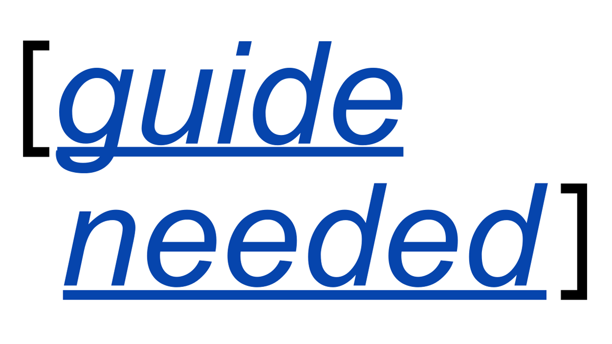

# Translation Systems for Global Knowledge Justice / Sistemas de traducción para un conocimiento justo y global. Simon Worthington (FORCE11) (English) - A Workshop

An invitation to participate in a workshop for share ideas on translation
workflows in open science publishing.

8-11 November 2021, online, 14:00-15:00 UTC (11:00-12:00 Santiago; 9:00-10:00
Toronto)

Register here: <http://openandinclusiveresearch.org/register/>

Taking place as part of the following event Open and Inclusive Access to
Research (OIAR). Organised between partners in South and North America.

The objective of the workshop is to create an outline of key issues in
translation systems to aid Open Science communities to better coordinate efforts
and put in place connected infrastructures. After the workshop *GenR*, the open
science blog, will produce a short guide to the issues involved — using ‘book
dashes’ (The Turing Way Community 2020) approach — as part of its Open Science
Guides programme [[guide needed](https://genr.eu/wp/guide-needed/)] See:
<https://genr.eu/wp/guide-needed/>

The following groups will present/attend the workshop:

-   CEVOpen using Wikidata - <https://github.com/petermr/CEVOpen/wiki>

    CEVOpen is an open research project to build multilingual semantic Atlas of
    Volatile Phytochemistry as well as a tool kit for others to use. The project
    uses Text and Data Mining on Open Access literature enable open search and
    semantification of the scientific literature. CEVOpen is an India, UK,
    Brazil, Canada founded collaboration.

-   Translate Science - <https://translatescience.org/>

    We are a new working group that wants to exchange information, lobby and
    build tools to make translations of scientific articles/reports/books,
    abstracts, titles and terms more accessible and (thus) stimulate the
    production of such translations.

    Translation Science is currently working on new software for a Translation
    Switchboard, see the recent blogpost (Nov 2021)
    <https://blog.translatescience.org/building-a-tool-to-find-translated-scientific-articles/>

-   AfricArXiv and Masakhane: Decolonise Science –
    <https://github.com/AfricArxiv/decolonise-science>

    Recently, as a pilot, one hundred and eighty articles from AfricaArxiv have
    been translated from French or English into six diverse African languages:
    isiZulu, Northern Sotho, Yoruba, Hausa, Luganda, and Amharic.

-   Single Source Publishing Community (SSPC):
    <https://github.com/singlesourcepub/community>

    Demo a workflow for translating OER with [Crowdin](http://crowdin.com/) in
    use for more than five years and is still free of charge for open-source
    projects. Crowdin <https://crowdin.com/>

    The SSPC is a network of stakeholders from the Open Science community that
    are interested in Single Source Publishing (SSP) for scholarly purposes –
    developing open-source software and advocacy.

There is an open pad for the workshop where you can find working notes. If you
are interested in taking part in the follow up Book Dash you can keep up-to-date
on the GenR forum - <https://github.com/Gen-R/organisation/discussions>

Pad: Workshop and Book Dash info: https://demo.hedgedoc.org/UB-o86LTTWmxxTN_Dc6d3Q

Fig. 100 Making your first pull request on GitHub. The Turing Way project illustration by Scriberia. Used under a CC-BY 4.0 licence. DOI: 10.5281/zenodo.3332807.¶

Contact: Simon Worthington, \@mrchristian99 <simon.worthington@tib.eu>

The workshop is a cooperation between FORCE11 and partners: *GenR* (TIB) Leibniz
Research Alliance Open Science.

The overall event OIAR is organised by
http://openandinclusiveresearch.org/aboutOIAR/ and sponsored by the following
<http://openandinclusiveresearch.org/sponsors/>

## References

The Turing Way Community. “The Turing Way Book Dashes,” 2020.
<https://the-turing-way.netlify.app/community-handbook/bookdash.html>.
